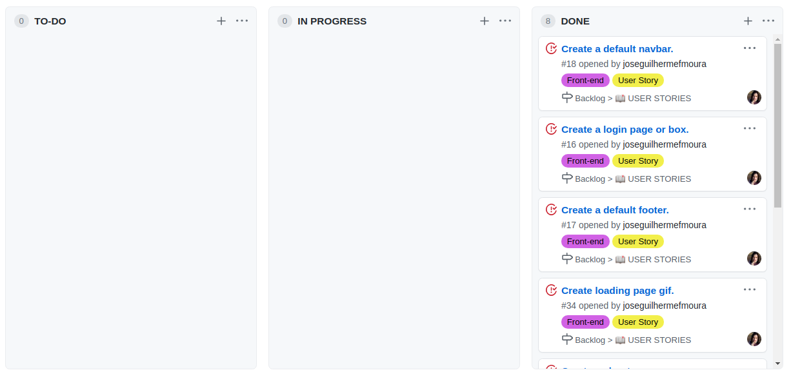
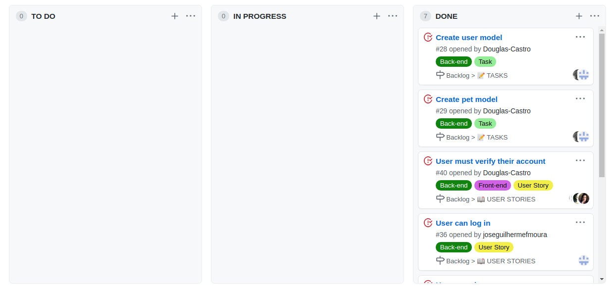
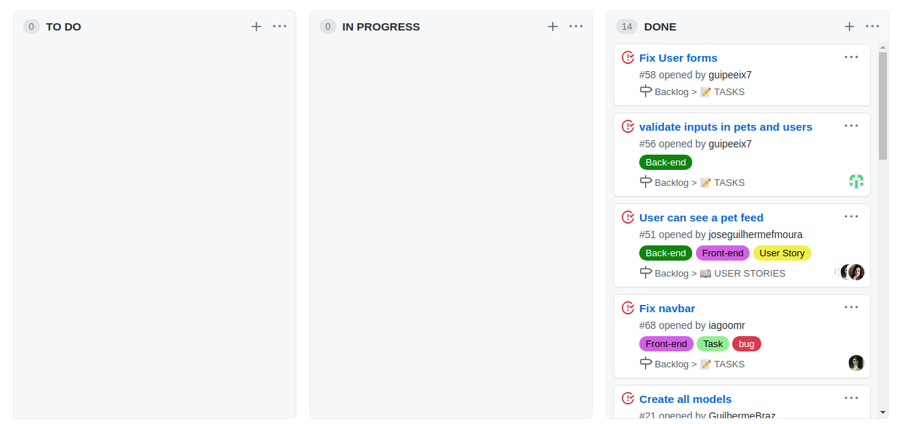
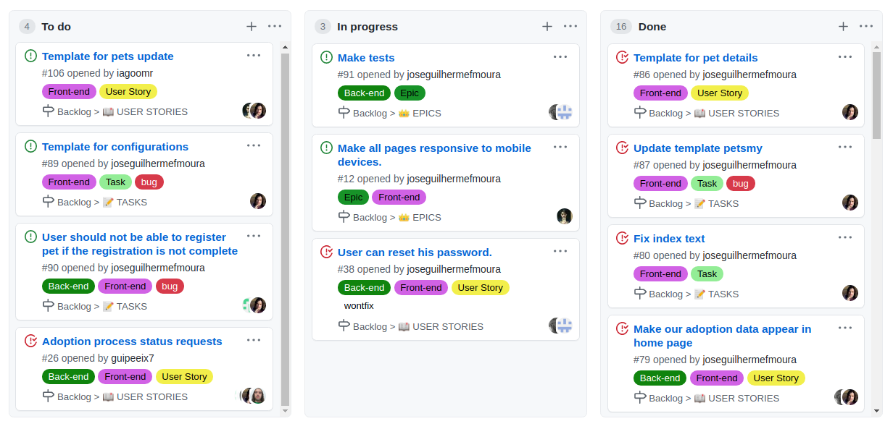

# Gerenciamento de Configuração de Software

Em cada uma das sprints foi desenvolvida uma versão. Elas podem ser acessadas pelos links abaixo.

## 
Historico de Versões

* <a href="https://github.com/Me-Adota/website/pull/35">V0.1</a> - 16/11 

* <a href="https://github.com/Me-Adota/website/pull/44">V0.2</a> - 23/10 

* <a href="https://github.com/Me-Adota/website/pull/64">V0.3</a> - 30/ 10 

* <a href="">V0.4</a> - 03/12 

## 
Quadros Kanban

### Sprint 1

### Sprint 2

### Sprint 3

### Sprint 4

