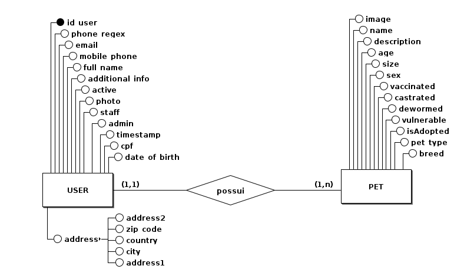
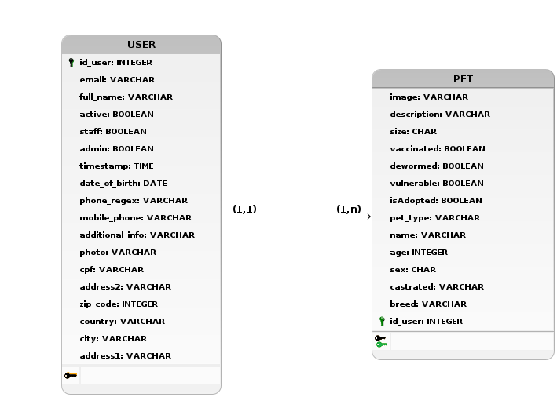
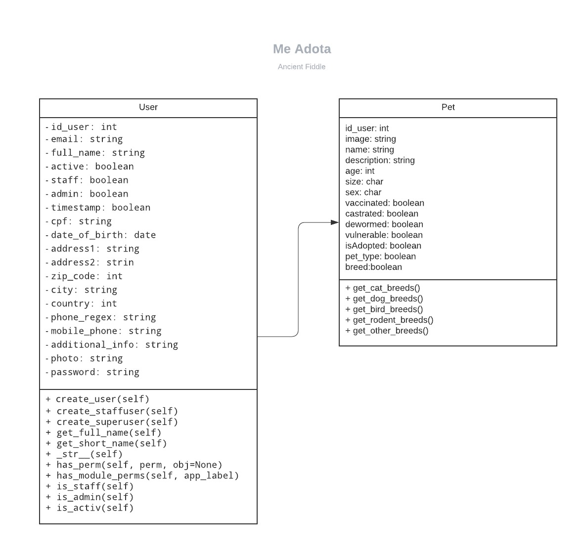

# Design de Software

## 
Modelagem Banco de Dados

### Modelo Entidade-Relacionamento (ME-R) 

#### Entidades 

* USER 

* PET 

#### Atributos 

* USER (id_user, email, full_name, active, staff, admin, timestamp, cpf, date_of_birth, address1, address2, zip_code, city, country, phone_regex, mobile_phone, additional_info, photo) 
    
* PET (id_user, image, name, description, age, size, sex, vaccinated, castrated, dewormed, vulnerable, isAdopted, pet_type, breed) 

#### Relações 

* Cardinalidade: n:1 

* Um USER possui n PET. Um PET pertence a um USER. 

### Diagrama Entidade-Relacionamento (DE-R) 

### Diagrama Lógico de  Dados (DLD)

## 
Diagrama de Classe

## 
Diagrama de Casos de Uso
